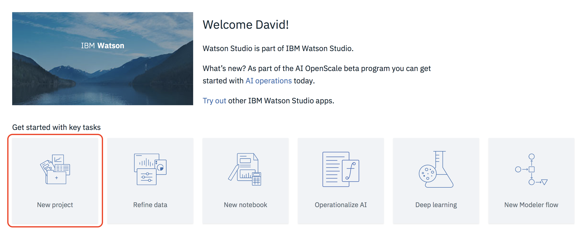
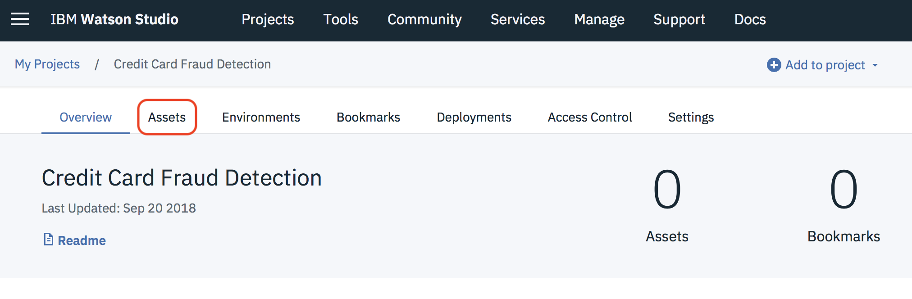
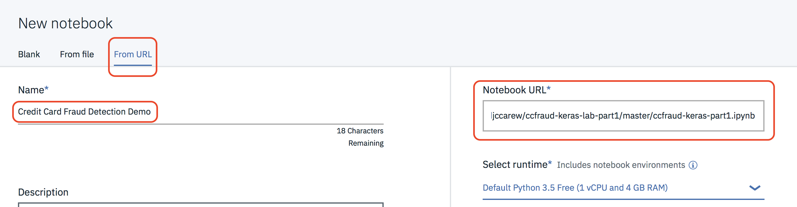
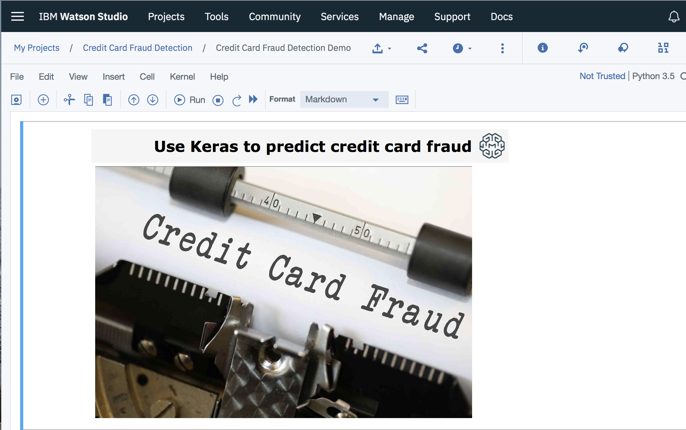

#  Predicting Credit Card Using Keras in Watson Studio

## Part 1 - Building and running the model

This notebook contains the steps and code to create a model that detects credit card fraud. You will use an anonymized data set of credit card transactions, which is available at Kaggle. The sample data set consists of 285K credit card transactions each with 31 columns.

The data is highly unbalanced as 98.828% are normal transactions and only 0.172% are fraudulent. This means that the overall accuracy of any model you build will not be a good measure of the model's performance. If you guess that every transaction is normal 100% of the time you would be right 99.828% of the time !

You will build a Logistic Regression model in Keras, which may seem unlikely at first, as Keras is a typically used for Deep Learning networks, however Logistic Regression is just a single layer neural network with no hidden layers, so Keras makes this very easy to build.

##  Setup

### 1 Sign up for Watson Studio

If you are not already signed up for Watson Studio, [sign up here](https://www.ibm.com/cloud/watson-studio)

### 2 Create a Watson Studio Project

2.1 From the Watson Studio home page click on **New Project**



2.2 Select a **Data Science** project type and click **OK**


2.3 Name the project *Credit Card Fraud Detection* and click **Create**

### 3. Create  and run this lab's notebook

3.1 Click on the **Assets** tab


3.2 Scroll down to the *Notebooks* section and click on **New Notebook**

3.3 Name the Notebook *Credit Card Fraud Detection Demo* . Select **From URL** and copy the following URL into the **Notebook URL** field

```https://raw.githubusercontent.com/djccarew/ccfraud-keras-lab-part1/master/ccfraud-keras-part1.ipynb```



3.4 Click on **Create Notebook**. After a few seconds the notebook should be loaded


3.5 Follow the instructions in the notebook to complete the exercise.
